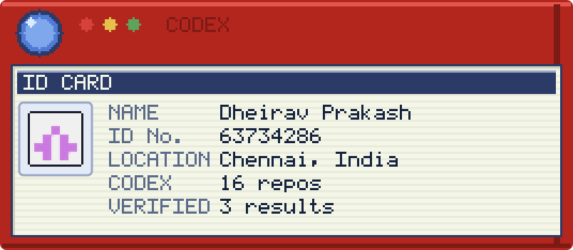
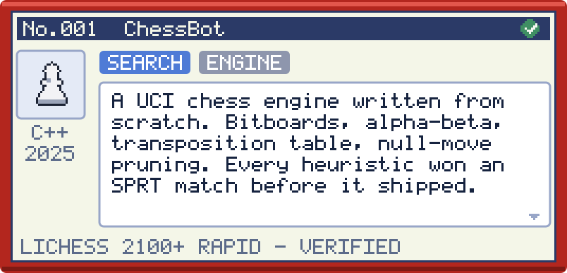
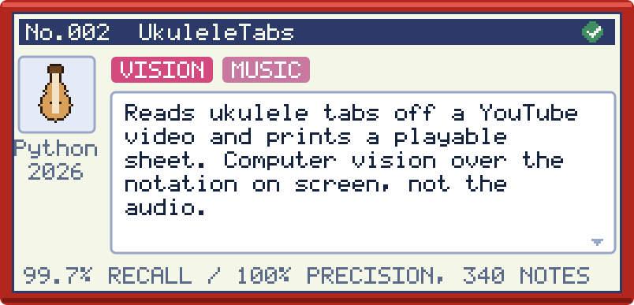
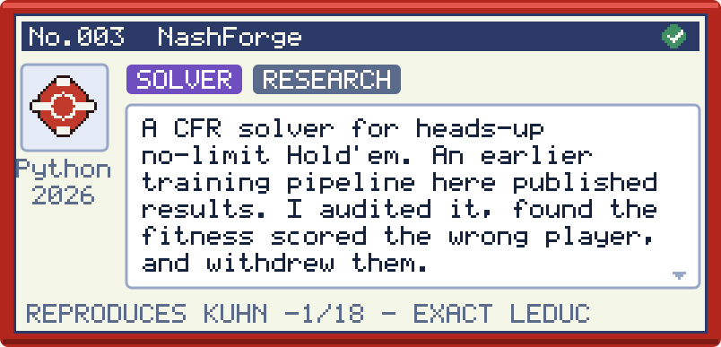
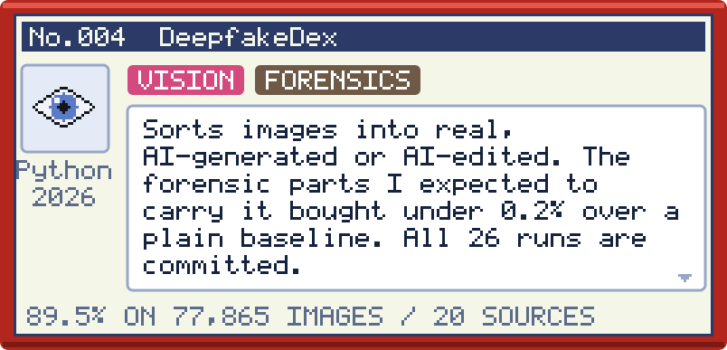
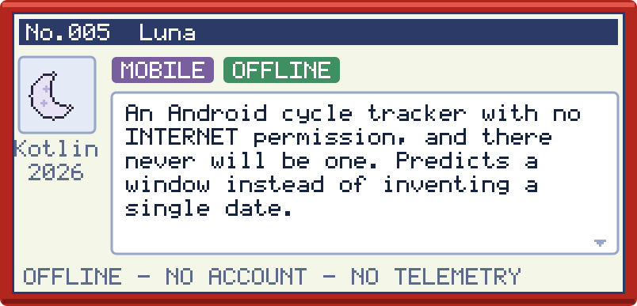
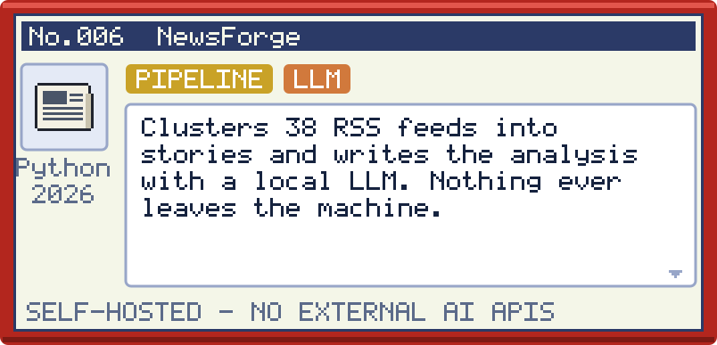
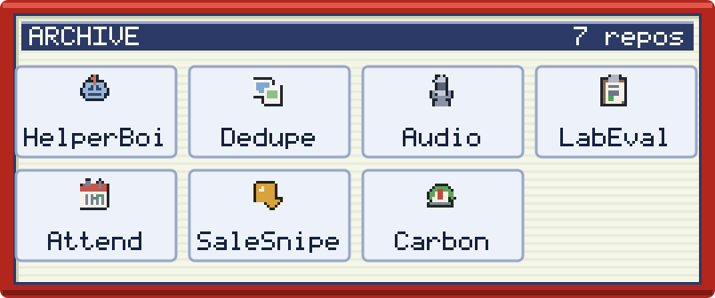

<picture>
  <source media="(prefers-color-scheme: dark)" srcset="codex/trainer-dark.svg">
  
</picture>

Fourth-year CSE at College of Engineering, Guindy, Anna University.
Most of what I build runs offline. If a project claims a number, whatever produced it is in the repo — a ✓ in the title bar means the number is checkable by someone who isn't me.

<a href="https://github.com/Dheirav/ChessBot"><picture>
  <source media="(prefers-color-scheme: dark)" srcset="codex/entry-001-dark.svg">
  
</picture></a>

<a href="https://github.com/Dheirav/UkuleleTabsMaker"><picture>
  <source media="(prefers-color-scheme: dark)" srcset="codex/entry-002-dark.svg">
  
</picture></a>

<a href="https://github.com/Dheirav/NashForge"><picture>
  <source media="(prefers-color-scheme: dark)" srcset="codex/entry-003-dark.svg">
  
</picture></a>

<a href="https://github.com/Dheirav/DeepFakeDetector"><picture>
  <source media="(prefers-color-scheme: dark)" srcset="codex/entry-004-dark.svg">
  
</picture></a>

<a href="https://github.com/Dheirav/Luna"><picture>
  <source media="(prefers-color-scheme: dark)" srcset="codex/entry-005-dark.svg">
  
</picture></a>

<a href="https://github.com/Dheirav/NewsLetterScrapper"><picture>
  <source media="(prefers-color-scheme: dark)" srcset="codex/entry-006-dark.svg">
  
</picture></a>

<a href="https://github.com/Dheirav?tab=repositories"><picture>
  <source media="(prefers-color-scheme: dark)" srcset="codex/archive-dark.svg">
  
</picture></a>

In the box:
<a href="https://github.com/Dheirav/HelperBoi">HelperBoi</a> ·
<a href="https://github.com/Dheirav/photo-dedupe-review">photo-dedupe-review</a> ·
<a href="https://github.com/Dheirav/AudioTranscriber">AudioTranscriber</a> ·
<a href="https://github.com/Dheirav/LabEvaluationSystem">LabEvaluationSystem</a> ·
<a href="https://github.com/Dheirav/Attendance_Tracker_Mobile">Attendance_Tracker_Mobile</a> ·
<a href="https://github.com/Dheirav/SaleSnipe">SaleSnipe</a> ·
<a href="https://github.com/Dheirav/Carbon_Gauge">Carbon_Gauge</a>

---

Negative results stay in the repo, and so do the retractions.
[`CODEBASE_AUDIT.md`](https://github.com/Dheirav/NashForge/blob/main/CODEBASE_AUDIT.md) is where I
established my own published results were wrong and withdrew them.

[LinkedIn](https://www.linkedin.com/in/dheirav-prakash-63a107308/) · [dheirav2005@gmail.com](mailto:dheirav2005@gmail.com)

Plain text (if images don't load)

**Dheirav Prakash** — Chennai, India. Fourth-year CSE at CEG, Anna University.

| Project | Stack | What it is |
|---|---|---|
| [ChessBot](https://github.com/Dheirav/ChessBot) | C++ | A UCI chess engine written from scratch. Plays rated on Lichess at 2100+ rapid. |
| [UkuleleTabsMaker](https://github.com/Dheirav/UkuleleTabsMaker) | Python, OpenCV | Reads ukulele tabs off a YouTube video. 99.7% recall, 100% precision on 340 hand-checked notes. |
| [NashForge](https://github.com/Dheirav/NashForge) | Python, Numba | A CFR solver for heads-up no-limit Hold'em. Reproduces Kuhn's −1/18, exact Leduc exploitability. |
| [DeepFakeDetector](https://github.com/Dheirav/DeepFakeDetector) | PyTorch | Real / AI-generated / AI-edited classification. 89.5% on 77,865 images across 20 sources. |
| [Luna](https://github.com/Dheirav/Luna) | Kotlin | An Android cycle tracker with no `INTERNET` permission. |
| [NewsLetterScrapper](https://github.com/Dheirav/NewsLetterScrapper) | Python, Ollama | 38 RSS feeds clustered into stories by a local LLM. Nothing leaves the machine. |

Also: [HelperBoi](https://github.com/Dheirav/HelperBoi), [photo-dedupe-review](https://github.com/Dheirav/photo-dedupe-review), [AudioTranscriber](https://github.com/Dheirav/AudioTranscriber), [LabEvaluationSystem](https://github.com/Dheirav/LabEvaluationSystem), [Attendance_Tracker_Mobile](https://github.com/Dheirav/Attendance_Tracker_Mobile), [SaleSnipe](https://github.com/Dheirav/SaleSnipe), [Carbon_Gauge](https://github.com/Dheirav/Carbon_Gauge)

